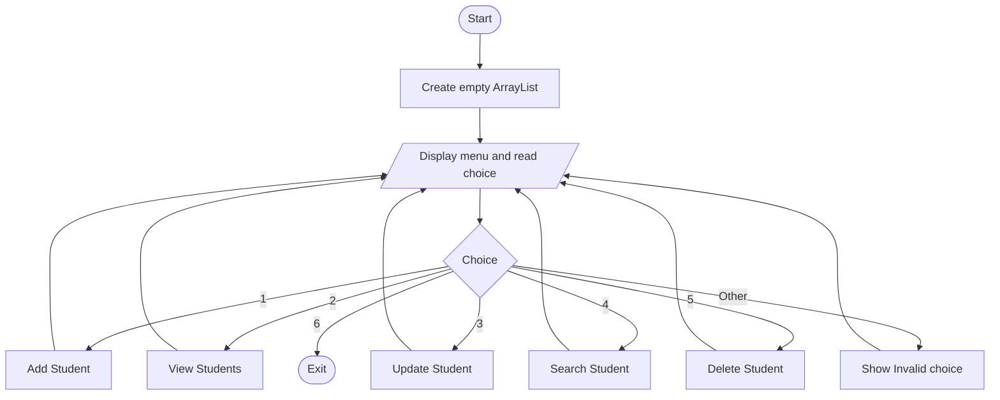
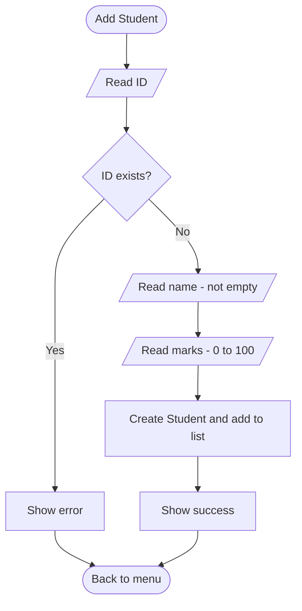
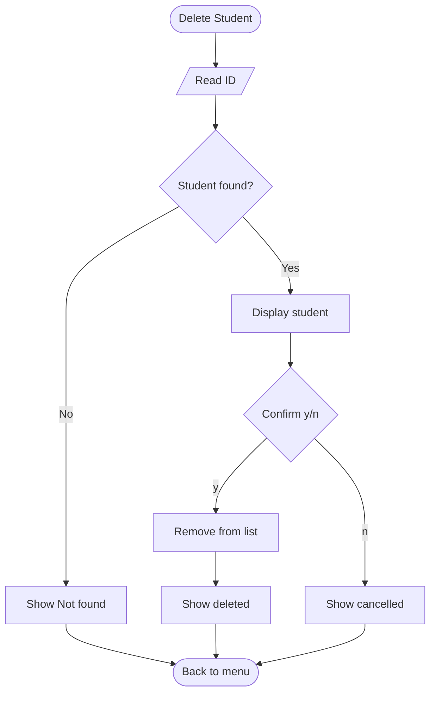

# Student Management System

A console-based Java application to manage student records (ID, name, marks) using an `ArrayList`.

| | |
|---|---|
| **Developer** | Aliyan Ahmad |
| **Program** | Auspify Java Developer Internship |
| **Task** | Task # 1 (Easy) - Student Management System |
| **Language** | Java 8 |
| **Storage** | `ArrayList<Student>` (in-memory) |

---

## 1. Objective
Build a Java console application that allows a user to add, view, update, search and delete student records, while demonstrating Core Java, OOP and the Collections Frameworks .

## 2. Features

| # | Feature | Description |
|---|---|---|
| 1 | Add Student | Insert a new record; duplicate IDs are rejected |
| 2 | View Students | Show all records in a table with a total count |
| 3 | Update Student | Change the name and marks of an existing student |
| 4 | Search Student | Find a student by ID |
| 5 | Delete Student | Remove a student after a y/n confirmation |
| 6 | Exit | Close the program |

Features 1, 2 and 4 are the required ones. Features 3 and 5 are extras added beyond the task requirements.

## 3. Requirements Mapping

| Task Step | Requirement | Implementation |
|---|---|---|
| Step 1 | Student class (id, name, marks) | `Student.java` |
| Step 2 | Insert student records | `addStudent()` |
| Step 3 | Display all student details | `viewStudents()` |
| Step 4 | Search student by ID | `searchStudent()` and `findById()` |
| Step 5 | Store data using ArrayList | `ArrayList<Student> students` |

## 4. Skills Demonstrated
- **Core Java:** loops, `switch`, methods, exception handling, `Scanner` input, string formatting
- **OOP:** encapsulation (private fields, getters/setters), constructor, immutable ID (`final`), `toString()` override
- **Collections:** `ArrayList` with `add()`, `remove()`, `isEmpty()`, `size()` and for-each iteration

## 5. Project Structure
```
Student-Management-System/
|-- Student.java             (model class)
|-- StudentManagement.java   (main class: menu + logic)
|-- DOCUMENTATION.md         (this document)
```

## 6. Class Design

```
Student                              StudentManagement
---------------------------          ------------------------------------
- id : int (final)                   - students : ArrayList<Student>
- name : String                      - sc : Scanner
- marks : double                     ------------------------------------
---------------------------          + main()
+ Student(id, name, marks)           - menu()
+ getId()                            - addStudent()
+ getName()                          - viewStudents()
+ getMarks()                         - updateStudent()
+ setName(name)                      - searchStudent()
+ setMarks(marks)                    - deleteStudent()
+ toString()                         - findById(id) : Student
                                     - printHeader()
                                     - readInt() / readName()
                                     - readMarks() / readYesNo()
```
**Relationship:** `StudentManagement` has many `Student` objects (composition through the `ArrayList`).

**Design decisions**
- The ID is `final` and has no setter, so it cannot be changed to a duplicate and bypass the duplicate check.
- All input uses `nextLine()` plus manual parsing. Mixing `nextInt()` with `nextLine()` leaves a newline in the buffer and causes skipped or empty inputs.
- Input helper methods validate data, so bad input never crashes the program.

## 7. Pseudocode

```
START
  CREATE empty list students

  REPEAT
    DISPLAY menu
    READ choice

    CASE 1 - ADD:
        READ id
        IF a student with this id exists THEN
            DISPLAY "Already exists"; GO BACK TO MENU
        READ name (must not be empty)
        READ marks (must be 0-100)
        ADD new Student(id, name, marks) to students
        DISPLAY "Added successfully"

    CASE 2 - VIEW:
        IF students is empty THEN
            DISPLAY "No students found"
        ELSE
            FOR EACH student IN students
                DISPLAY student row
            DISPLAY total count

    CASE 3 - UPDATE:
        READ id
        FIND student by id
        IF not found THEN
            DISPLAY "Not found"
        ELSE
            DISPLAY current record
            READ new name, new marks (validated)
            UPDATE student
            DISPLAY "Updated successfully"

    CASE 4 - SEARCH:
        READ id
        FIND student by id
        IF found THEN DISPLAY student ELSE DISPLAY "Not found"

    CASE 5 - DELETE:
        READ id
        FIND student by id
        IF not found THEN
            DISPLAY "Not found"
        ELSE
            DISPLAY student
            ASK "Are you sure? (y/n)"
            IF yes THEN REMOVE student; DISPLAY "Deleted"
            ELSE DISPLAY "Cancelled"

    CASE 6 - EXIT:
        DISPLAY "Goodbye"; STOP loop

    OTHERWISE:
        DISPLAY "Invalid choice"
  UNTIL user chooses Exit
END

FUNCTION findById(id):
    FOR EACH student IN students
        IF student.id == id THEN RETURN student
    RETURN null
```

## 8. Flowchart

### 8.1 Main program flow


### 8.2 Add Student


### 8.3 Delete Student


Update and Search follow the same pattern: read ID, find student, then show the result or "Not found".

## 9. How to Compile and Run

```
javac Student.java StudentManagement.java
java StudentManagement
```

## 10. Sample Output

```
===== STUDENT MANAGEMENT SYSTEM =====
1. Add Student
2. View Students
3. Update Student
4. Search Student
5. Delete Student
6. Exit
=====================================
Enter your choice: 1
Enter Student ID: 101
Enter Student Name: Aliyan
Enter Student Marks (0-100): 96
Student added successfully.

Enter your choice: 2

| ID     | Name                 | Marks   |
|--------|----------------------|---------|
| 101    | Aliyan               | 96.00   |
Total students: 1
```

## 12. Known Limitations
- Data is stored in memory only and is lost when the program closes.
- Search is a linear scan, which is fine for small data sets.
- IDs are integers, so leading zeros (for example `001`) are not preserved.

## 13. Future Enhancements
- Save and load records from a file (File I/O) or a database (JDBC)
- Sort students by marks or name, and calculate grades
- Use a `HashMap<Integer, Student>` for faster lookup by ID
- Add unit tests with JUnit
- Convert to a GUI or Spring Boot REST API
